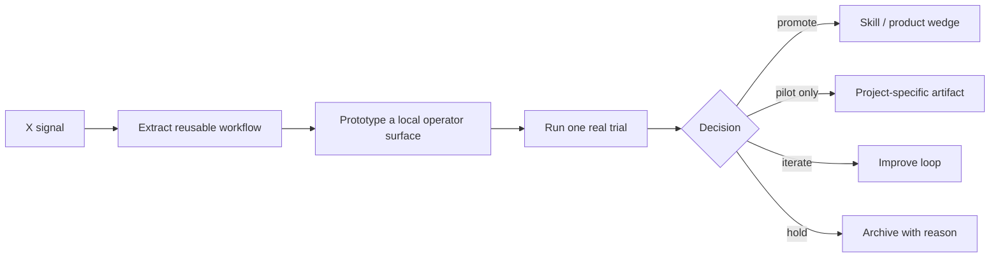

# Capability Overhang Eval Radar Workflow Map

Source: [[../../Ideas/Evals-Led Venture Firms as Model Capability Arbitrage.md|Evals-Led Venture Firms as Model Capability Arbitrage]]

## Why it matters
Model evals can become business-development radar: repeated niche benchmarks expose where models crossed a usefulness threshold before buyers, investors, or competitors notice.

## Operator rule
Prepared artifacts are not validation. Only filled trial evidence can justify promotion.
